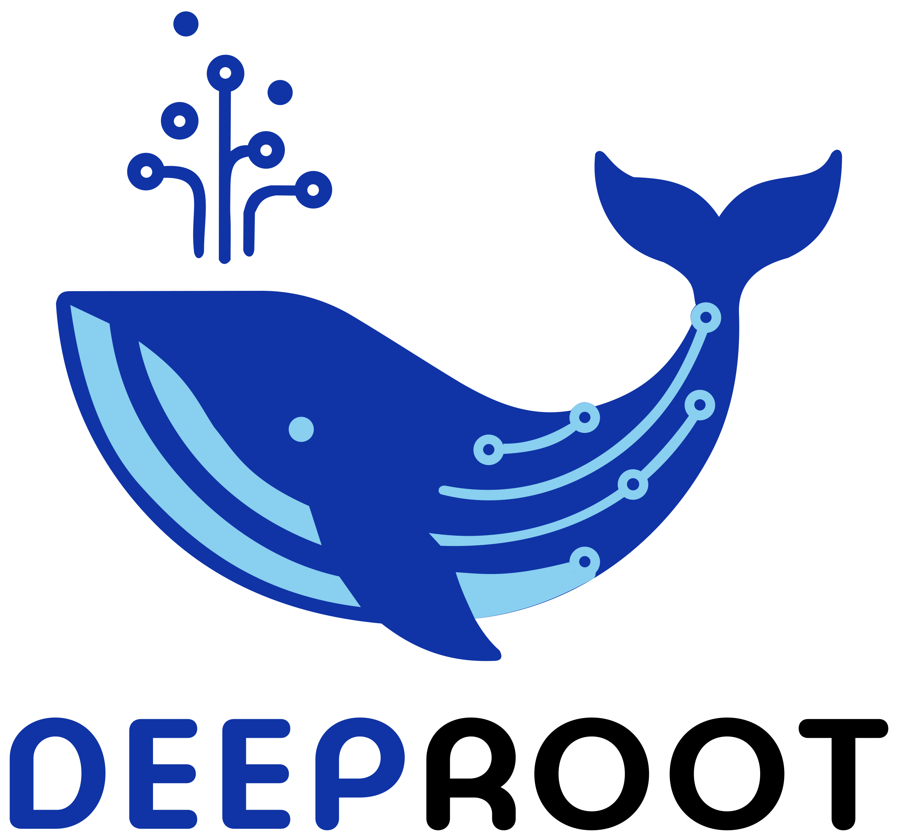
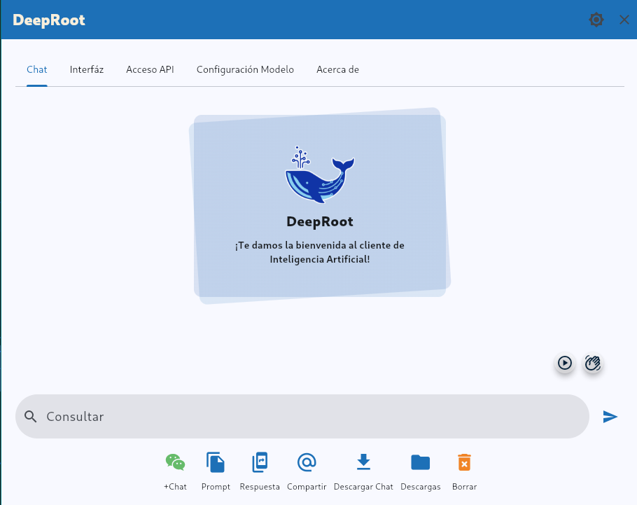
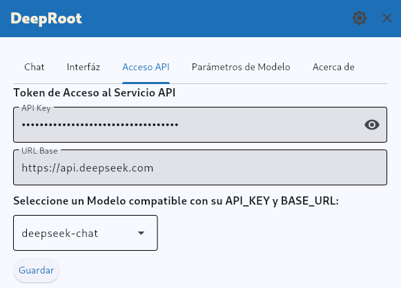
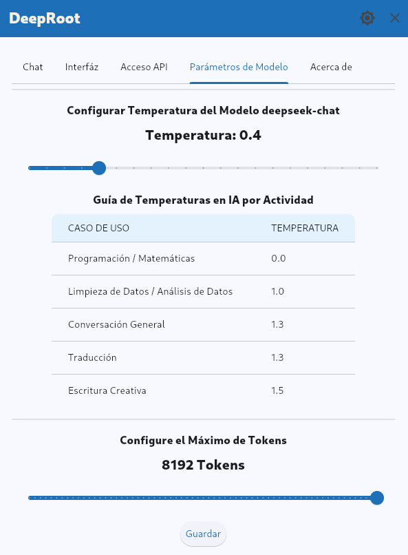

# 🐋 DeepRoot - Interfaz gráfica para interacción con modelos avanzados de IA (LLMs)

[](LICENSE)


**Aplicación de escritorio para interactuar con modelos de IA como DeepSeek y Gemini**  
*Actualización constante de modelos compatibles vía API*

  
*Ballena de DeepRoot - Símbolo de raíces profundas*  

---
## 📹 Videos Relacionados
1. **Demo de Instalación**:  
   [](https://rutube.ru/video/f59e3cd104a92965b0add83a40c95047/)
2. **Ponencia FLISoL 2025**:  
   [](https://rutube.ru/video/f44cd2d55b1a54142cff072faace7133/)

---
## 📌 Tabla de Contenidos
1. [Filosofía](#-filosofía)
2. [Características](#-características)
3. [Instalación](#-instalación)
4. [Interfaz](#-interfaz)
5. [Uso Avanzado](#-uso-avanzado)
6. [Reportar Problemas](#-reportar-problemas)
7. [Contribuir](#-contribuir)
8. [Licencia](#-licencia)

---
## 🌍 Filosofía
**DeepRoot** - Herramienta venezolana que democratiza el acceso a IA avanzada mediante software libre. Inspirada en principios de soberanía tecnológica y desarrollo comunitario.

### Idiomas Disponibles:
- **English**: Venezuelan-developed GUI for uncensored AI access
- **中文**: 自由软件AI桌面客户端
- **Русский**: Свободный графический клиент ИИ

---
## 🚀 Características  

### 🔍 Multi-Modelos  
- Soporte para **deepseek-chat**, **deepseek-coder**, **deepseek-reasoner** y **gemini-2.0-flash**  
- Configuración de parámetros (tokens, temperatura)  

### 🎨 Personalización  
- Temas claros/oscuros  
- Resaltado de sintaxis  

### 📤 Exportación  
- Conversaciones en Markdown/HTML  
- Compatibilidad con Obsidian  

---
## 🖼️ Interfaz Gráfica

  
*Interfaz principal con áreas de chat y controles*

  
*Ingreso de credenciales API*

  
*Ajustes avanzados de modelos*

---
## 📥 Instalación  

### Requisitos  
- **Python 3.8+**  
- **Git** (opcional)  

### 1. Método Automático  
```bash
curl -sSL https://raw.githubusercontent.com/jonasreyes/deeproot/main/scripts/deeproot_install.sh | bash
```

### 2. Manual  
```bash
git clone https://github.com/jonasreyes/deeproot.git
cd deeproot
./scripts/deeproot_install.sh
```

---
## 🗑️ Desinstalación  
```bash
curl -sSL https://raw.githubusercontent.com/jonasreyes/deeproot/main/scripts/deeproot_uninstall.sh | bash
```

---
## 🐞 Reportar Problemas  

### Para usuarios noveles:  
1. **Describe el problema**: Qué esperabas vs qué ocurrió  
2. **Pasos para reproducirlo**:  
   ```
   1. Abrir DeepRoot  
   2. Ir a Configuración API  
   3. Ingresar clave inválida  
   ```  
3. **Captura de pantalla** (opcional pero útil)  

### Opciones:  
- [Abrir Issue en GitHub](https://github.com/jonasreyes/deeproot/issues)  
- [Formulario de Telegram](https://t.me/deeproot_app) (más sencillo)  

---
## 🤝 Contribuir  
1. Haz fork del repositorio  
2. Crea una rama: `git checkout -b mi-mejora`  
3. Envía Pull Request  

*¿Primera vez contribuyendo?* [Guía básica](https://guides.github.com/activities/hello-world/)  

---
## 📜 Licencia  
[Licencia DeepRoot](LICENSE) (GPL-compatible)  

---
## 🔗 Enlaces  
- [Canal Oficial](https://t.me/deeproot_app)  
- [Desarrollador](https://t.me/jonasroot)  
- [Repositorio](https://github.com/jonasreyes/deeproot)  

*¡Gracias por usar DeepRoot!* 🐋💙  
